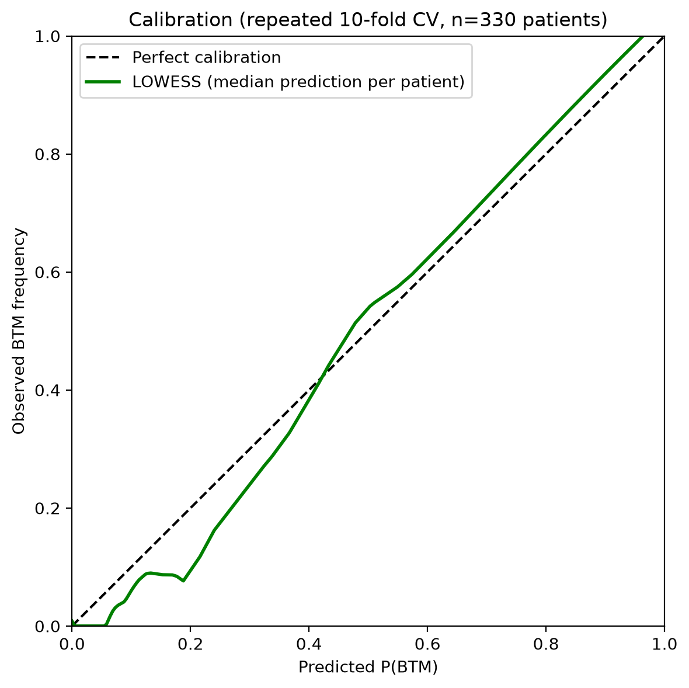
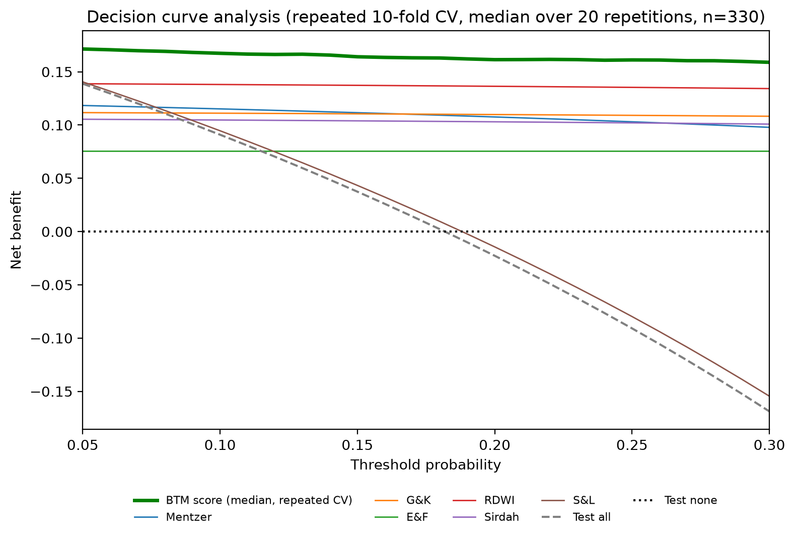
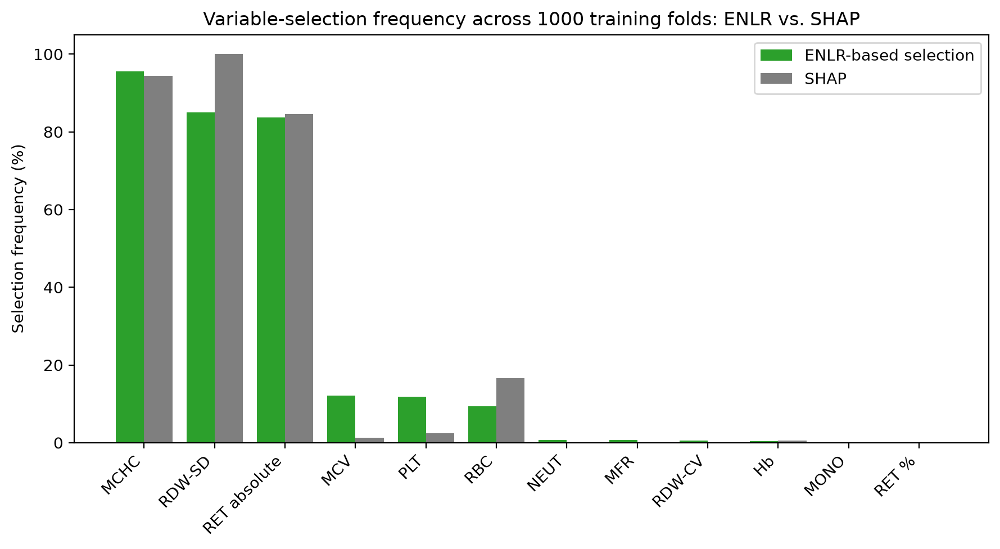

# BTM Score — iron deficiency anemia vs. beta-thalassemia minor

[](https://doi.org/10.5281/zenodo.23127874)

This repository contains the complete analysis pipeline used to develop and internally validate the
**BTM score**, a three-variable logistic-regression score that differentiates iron deficiency anemia (IDA)
from beta-thalassemia minor (BTM) using complete blood count (CBC) parameters.

The three variables are chosen by a pre-specified Elastic-Net-based rule (the three largest absolute
standardised coefficients of an Elastic Net fitted on the 20 candidate CBC parameters), inside every training
fold of every validation scheme; the score is the restricted Elastic Net refitted on those three variables.
The cohort comprises 330 patients (270 IDA, 60 BTM) from a single centre. Internal validation combines a
1,000 × 70/30 Monte Carlo comparison with 13 conventional indices, a Harrell optimism-corrected bootstrap of
the entire procedure, and repeated 10-fold cross-validation.

Developed at the Department of Hematology and Blood Bank, La Rabta Hospital, Tunis, Tunisia.

> **Research tool, not a validated medical device.** The score was developed and internally validated on one
> cohort; it has not been externally validated.

## The score

For one patient, with **MCHC in g/dL**, **RDW-SD in fL** and **RET (absolute reticulocyte count) in ×10⁹/L**
(= ×10³/µL):

```
z      =  0.7630 × MCHC  −  0.3930 × RDW-SD  +  0.0643 × RET  −  13.1246
P(BTM) =  1 / (1 + exp(−z))
```

Classify as BTM if **P(BTM) > 0.3700**. This threshold is the Youden-optimal cut-off on out-of-fold predictions;
on the development data it coincides with the highest threshold reaching at least 95% sensitivity (the Excel
calculator lists both rows, which have the same value). In the Monte Carlo validation the sensitivity estimate of
the 95%-sensitivity rule is 0.921 (0.910 for the Youden rule).

Entering other units gives a wrong probability. Raw reticulocyte counts stored in cells/µL must be divided by
1,000 first. A universal version using only MCHC, MCV and RBC (any analyser) is reported as a supplementary
analysis; see [`results_summary.md`](results_summary.md).

**Excel calculator:** [`results/BTM_score_calculator.xlsx`](results/BTM_score_calculator.xlsx) — enter the three
values in the yellow cells; it returns z, P(BTM) and the classification, and states the unit next to each input.

## Main figures

Numbering follows the manuscript (Figure 1, the participant flow, is drawn separately).

**Figure 2 — calibration (repeated 10-fold cross-validation)**



**Figure 3 — decision curve analysis**



**Figure 4 — concordance between ENLR-based and SHAP-based variable selection**



## Contents

| Path | Description |
|---|---|
| [`BTM_score_analysis.ipynb`](BTM_score_analysis.ipynb) | The complete analysis notebook, executed, with all outputs (single source of truth). All analysis parameters are documented in its first code cell. |
| [`results_summary.md`](results_summary.md) | Every reported number with its source section and cell, run provenance, and the release note. |
| [`WORKFLOW_OVERVIEW.md`](WORKFLOW_OVERVIEW.md) | Workflow diagram, section-by-section summary, key results, mapping of results to manuscript tables/figures, limitations. |
| [`DATA_DICTIONARY.md`](DATA_DICTIONARY.md) | Expected columns of the input file, units, and the units in which the formulas must be applied. |
| `results/` | CSV tables (aggregate results only), figures in `results/figures/`, and the Excel calculator. No patient-level data. |
| `scripts/` | `identity_test.py` (the parallel run reproduces the sequential run exactly) and `check_notebook_outputs.py` (checks the saved notebook; `--self-test` shows that each rule fires). |
| `requirements.txt` | Pinned Python dependencies (the versions used for the reported results). |
| `CITATION.cff`, `LICENSE` | Citation metadata; MIT licence. |

## Reproducing the analysis

The reported results were produced with **Python 3.13.14** and the pinned versions in
[`requirements.txt`](requirements.txt). The patient-level data file is not distributed (see below); to rerun the
notebook, place a file with the columns described in [`DATA_DICTIONARY.md`](DATA_DICTIONARY.md) at
`data/cohort_after_cleaning.xlsx`. Execution order, from the repository root:

```bash
python -m venv .venv                      # then activate it
pip install -r requirements.txt
python scripts/identity_test.py           # optional, a few minutes: parallel run == sequential run
jupyter nbconvert --to notebook --execute --inplace BTM_score_analysis.ipynb
python scripts/check_notebook_outputs.py  # checks the saved notebook
```

The full run is computation-heavy (several CPU-hours: thousands of repetitions of the complete
score-derivation procedure, nested cross-validation included). Simulations run in parallel on worker processes
with one deterministic seed per iteration, so results do not depend on the number of workers (measured at about
1 h 35 min wall-clock on a 4-core / 8-thread laptop with 8 workers). Heavy results are cached in `cache/`
(git-ignored because it holds per-patient predictions) under a fingerprint of the code, parameters and data.
Keep the computer awake for the duration of the run. Setting the environment variable `BTM_SMOKE_TEST=1`
runs the whole notebook with tiny iteration counts as a dry run; its output goes to `results_smoke/` and is never
reportable.

## Data availability

The data are available from the corresponding author upon reasonable request, subject to ethics committee
approval.

## Licence

Released under the [MIT License](LICENSE).

## How to cite

Please cite this repository using [`CITATION.cff`](CITATION.cff) (GitHub shows a "Cite this repository" button).
The archived releases are on Zenodo:

- **Version DOI (v1.0.0):** [10.5281/zenodo.23127874](https://doi.org/10.5281/zenodo.23127874) — cite this one to refer to the exact version described in the manuscript.
- **Concept DOI (all versions):** [10.5281/zenodo.23127873](https://doi.org/10.5281/zenodo.23127873) — always resolves to the latest version.

Srairi M, Chakroun A, Eddhib J, Baccouche H, Mahjoub S. *BTM Score: development and internal validation of a
diagnostic score for beta-thalassemia minor versus iron deficiency anemia* (version 1.0.0). 2026. Zenodo.
https://doi.org/10.5281/zenodo.23127874 (repository: https://github.com/mayarsrairi/BTM-Score)
