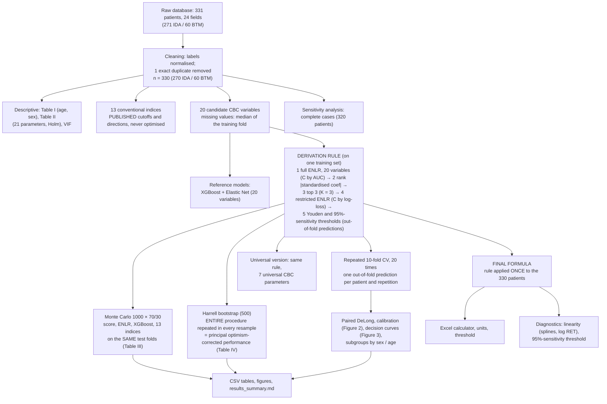

# BTM score — workflow overview

This document describes the final state of the work: the executed notebook `BTM_score_analysis.ipynb`
(final aggregation code commit `dceef39`; simulations computed at commit `5ad10bb`; both commits belong to the
private development repository and the provenance of the simulations was reconstructed retrospectively — see
[`results_summary.md`](results_summary.md)).
Every number comes from `results_summary.md` and `results/*.csv`; none was recomputed for this document.
Cohort: **330 patients (270 IDA, 60 BTM), BTM prevalence 18.2%**.

---

## a) Workflow, from the raw database to the final score

**Steps, in the execution order of the notebook**

1. **Fixed parameters** (cell 1): defined once at the top of the notebook; one deterministic seed per iteration.
2. **Cleaning**: raw database of 331 patients (271 IDA, 60 BTM); 1 exact duplicate (identical on all 24 fields, IDA) removed → 330.
3. **Descriptive statistics**: Table I, Table II, VIF.
4. **Conventional indices**: 13 formulas with published cutoffs and directions; evaluated **only** inside the validation schemes, on the same patients and the same imputed values as the models.
5. **Within-fold imputation**: median of the training fold, applied to the test fold, for the models **and** the indices (RDW-SD and RDW-CV missing in 8 patients, all IDA; NEUT, LYMPH, MONO, EO, BASO and HFR missing in 1 patient each).
6. **Reference models**: XGBoost (100 trees, depth 3) and Elastic Net on the 20 variables.
7. **ENLR derivation rule (K = 3)**: detailed in the diagram; applied identically in every Monte Carlo iteration, bootstrap resample and CV fold, and for the final formula.
8. **Final formula**: the rule applied once to the whole cohort (whole-cohort median imputation).
9. **Internal validation**: Monte Carlo 1000 × 70/30; Harrell bootstrap 500 (principal); repeated CV 20 × 10.
10. **Universal version**: same rule on 7 parameters (RBC, Hb, HCT, MCV, MCH, MCHC, RDW-CV).
11. **Comparisons**: paired DeLong against 12 indices (MCHD excluded) and against the 2 models with 20 variables.
12. **Calibration, decision curves, descriptive comparison with the literature, EPV and Riley criteria.**
13. **Sensitivity analyses and supplementary analyses**: subgroups, linearity, 95%-sensitivity threshold, complete cases, Harrell slope without quasi-separated resamples.
14. **Excel calculator, checks (no local path, no patient-level output), export.**

**Fixed parameters (all documented in cell 1 of the notebook)**: base seed 42; Monte Carlo 1000 iterations, 30% test; bootstrap 500; repeated CV 20 × 10 folds;
K = 3; l1_ratio 0.5; C grid: 10 values from 10⁻³ to 10² (log scale); inner CV 5 folds; C of the full model chosen by **AUC**, C of the restricted model by **log-loss**;
SAGA, 5000 iterations maximum; Youden threshold on out-of-fold predictions; "high-sensitivity" threshold = highest threshold reaching ≥ 95% sensitivity on the out-of-fold predictions;
XGBoost: 100 trees, depth 3, learning rate 0.1; age cut-off 45 years.

---

## b) Section by section: objective, method, sample sizes, files, key results

| § | Objective | Method and parameters | Sample (patients / BTM) | Files produced | Key results |
|---|---|---|---|---|---|
| 1 Setup | Fix and document the parameters; infrastructure (parallel execution, cache, checks) | See parameters above; 8 worker processes; cache tied to a fingerprint of code, parameters and data | — | — | Sequential/parallel identity test: bit-for-bit identical (3 task types) |
| 2 Data | Analysable cohort | Labels normalised; exact duplicate removed | 331 → **330 / 60**; complete cases 320 / 60 | — | 1 duplicate removed; prevalence 18.2% |
| 3 Table I | Baseline characteristics | Mann-Whitney (age), Fisher (sex) | 330 / 60 | in `results_summary.md` | Age BTM 45.5 ± 14.1 vs IDA 43.3 ± 16.1 (p = 0.139); female 78.3% vs 84.8% (p = 0.247) |
| 4 Table II | Compare 21 parameters | Mann-Whitney, Holm correction; RET absolute in ×10⁹/L | 330 / 60 | in `results_summary.md` | All significant after Holm except MCH (0.769), MONO (0.733), EO (0.733), BASO (0.604); HFR Holm p 0.048 |
| 5 Indices | Define the 13 indices | Published cutoffs and directions, not optimised; MCHD: published direction kept, shown descriptively only | — | — | MCHD: AUC 0.098 (direction inverted in this cohort) |
| 6 Variables | Set of 20 candidate variables | Within-fold imputation; global imputation only for VIF, final formula, SHAP | 330 / 60 | — | Missing: RDW-SD 8, RDW-CV 8, six other variables 1 each |
| 7 VIF | Collinearity of the 7 basic parameters | VIF with constant | 330 / 60 | in `results_summary.md` | MCH 213, Hb 209, HCT 138, RBC 102, MCV 98, MCHC 53, RDW-CV 1.5 |
| 8 Rule + 8.1 | Define the rule; show that parallel = sequential | See diagram; 10 tasks of each type compared | — | — | Exact identity (Monte Carlo, bootstrap, CV) |
| 8.2 Monte Carlo (**Table III**) | Compare score, ENLR, XGBoost and 13 indices on identical folds | 1000 stratified 70/30 splits; undefined PPV/NPV excluded (NaN) | median test fold **99 / 18**; training 231 / 42 | `monte_carlo_table.csv` | **Score: AUC 0.977 [0.937–1.000]**, sens 0.910, spec 0.958, PPV 0.841, NPV 0.980, accuracy 0.949; ENLR 20 variables: AUC 0.988; XGBoost: 0.984; 95%-sensitivity rule: sens 0.921, spec 0.942; best indices: G&K 0.971, E&F 0.960, RDWI 0.957, Sirdah 0.957, MDHL 0.952 |
| 8.3 Concordance (**Figure 4**) | ENLR vs SHAP for variable selection | Same 1000 training folds | same | `concordance_enlr_shap.csv`, `fig_concordance_enlr_shap.png` | MCHC 95.6% (SHAP 94.4%), RDW-SD 85.0% (100%), RET 83.7% (84.6%); same dominant combination (72% / 79%); identical top 3 in 61%, ≥ 2 of 3 in common in 92% |
| 8.4 AUC differences | Paired difference (variability, not a test) | Mean and 2.5–97.5 percentiles | same | `paired_auc_differences_monte_carlo.csv` | Score − ENLR −0.011 [−0.045; 0.003]; score − XGBoost −0.008 [−0.045; 0.028] |
| 8.5 ROC / matrices (supplement) | Mean curves of the 2 models | Mean and 2.5–97.5 band | same | `fig_roc_confusion_xgboost.png`, `fig_roc_confusion_elastic_net.png` | AUC 0.984 / 0.988 |
| 9 SHAP (supplement) | Illustration, **not** used for selection | XGBoost on the whole cohort; fixed seed (reproducible figure) | 330 / 60 | `fig_shap_illustration.png`, `shap_importance_illustration.csv` | RDW-SD 2.17 > MCHC 1.20 > RET 1.01 > PLT 0.57 > RBC 0.51 |
| 10 Formula | Deployable formula | Rule applied once to the 330 patients | 330 / 60 | Excel calculator | **z = 0.7630·MCHC − 0.3930·RDW-SD + 0.0643·RET(×10⁹/L) − 13.1246**; P = 1/(1+e⁻ᶻ); threshold **0.3700** (Youden index; on the development data it coincides with the highest threshold reaching ≥ 95% sensitivity); median IDA patient P = 0.002, median BTM patient P = 0.971 |
| 10bis Illustrative split (supplement) | Auditable example | Everything redone on 70% (seed 42) | 99 / 18 | `fig_illustrative_split.png` | AUC 0.990, sens 0.889, spec 0.975; percentile ranks 34–65%: a typical draw, not an improvement |
| 11 Harrell (**Table IV**) | **Principal performance** | 500 resamples, entire procedure repeated; intervals are bootstrap percentile intervals (2.5th–97.5th percentiles of the per-resample optimism-corrected values; not confidence intervals) | 330 / 60 per resample | `harrell_main.csv`, `harrell_main_complement.csv`, `harrell_slope_sensitivity_analysis.csv` | **Corrected AUC 0.977 [0.962–0.994]**; Brier 0.0275; sens 0.920 [0.851–0.976]; spec 0.976 [0.953–1, truncated]; **corrected slope 0.54 [0.27–1.34]**; intercept 0.03 [−0.59; 0.71]; (complement: median bootstrap slope 0.97) |
| 12 Universal (**Table IV**, second panel) | Version using only parameters available on all analysers (not validated on other platforms) | Same rule, 7 variables | 330 / 60 | `monte_carlo_table_universal.csv`, `harrell_universal*.csv` | MCHC, MCV, RBC: z = 1.1672·MCHC − 0.2120·MCV + 2.4580·RBC − 35.1126 (threshold 0.2071); Monte Carlo AUC 0.971 [0.918–0.995]; Harrell AUC 0.9735 [0.950–0.997], slope 1.00 [0.60–1.35]; paired AUC difference, main score minus universal score: +0.006 [−0.041; 0.050] |
| 13 Repeated CV | Valid out-of-fold predictions for DeLong, calibration, DCA | 20 × 10 folds, median across repetitions | training fold 297 / 54, test 33 / 6; **330 / 60 per repetition** | — | 200 models |
| 13.1 DeLong (supplement) | Compare AUCs (the only place where "significant" is used) | Paired, Holm within each repetition; 12 indices (MCHD excluded) + 2 models | 330 / 60 | `delong_vs_indices.csv`, `delong_vs_models.csv` | Score AUC 0.979; significant in 100% of repetitions: Srivastava, S&L, CRUISE, HH; 95%: Mentzer, Ehsani; 85%: Ricerca; never: RDWI, E&F, G&K, Sirdah, MDHL, nor vs Elastic Net (difference −0.006) nor vs XGBoost (−0.005) |
| 13.2 Calibration (**Figure 2**) | Out-of-fold calibration | Slope, intercept, Brier; median and range; Figure 2 shows one LOWESS curve per repetition, their median, and a histogram of the predictions (proportions, pooled across the 20 repetitions of the same 330 patients) | 330 / 60 | `calibration_repeated_cv.csv`, `fig_calibration.png` | Slope 1.05 [0.85–1.21]; intercept −0.02; Brier 0.0266 |
| 13.3 DCA (**Figure 3**) | Clinical utility | Median net benefit, thresholds 0.05–0.30; indices at published cutoffs | 330 / 60 | `decision_curve_net_benefit.csv`, `decision_curve_prevalence_sensitivity.csv`, `fig_decision_curve.png` | Net benefit 0.171 / 0.167 / 0.161 / 0.159 (thresholds 0.05 / 0.10 / 0.20 / 0.30), the highest of all strategies at all 26 thresholds, minimum margin 0.017 at 0.05 |
| 13.4 Literature (supplement) | Descriptive comparison (no test) | Table | — | `external_scores_descriptive.csv` | This study 0.977 vs 0.921–0.990 across studies |
| 13.5 Sample size (supplement) | EPV and Riley criteria | Each criterion separately | 330 / 60 | `riley_sample_size.csv` | EPV 3.0; criterion 1 met only if R² ≥ 0.70 (309 required); criterion 2 never (488–612); criterion 3 always (229) |
| 14.1 Subgroups (supplement) | Performance by sex and age | Out-of-fold predictions, fold thresholds; median [min–max] over 20 repetitions | F 276/47; M 54/13; < 45 years 185/26; ≥ 45 years 145/34 | `subgroup_performance.csv` | AUC F 0.992, M 0.932, < 45 0.959, ≥ 45 0.995; sens M 0.846 |
| 14.2 Linearity (supplement) | Splines and log(RET) | Restricted cubic splines (3 knots), likelihood-ratio test; the formula stays linear | 330 / 60 | `linearity_lr_tests.csv`, `linearity_model_comparison.csv` | p: MCHC 0.889, RDW-SD 0.051, RET 0.206; joint 0.133; log(RET) not better (AIC 79.3 vs 69.8) |
| 14.3 95%-sensitivity threshold (supplement) | Alternative threshold rule | Derived in each training fold | 330 / 60 | `high_sensitivity_threshold.csv` | 95%-sensitivity rule: sens 0.921 [0.722–1.000] (Monte Carlo), 0.950 (CV median), Harrell 0.923; spec 0.942 / 0.933 / 0.978. Youden rule: sens 0.910 / 0.917 / 0.920; spec 0.958 / 0.965 / 0.976. Both rules give the same threshold, 0.3700, on the final fit |
| 14.4 Complete cases (supplement) | No imputation at all | Same procedure, 1000 × 70/30 | **320 / 60** | `complete_case_sensitivity.csv` | AUC 0.975 [0.934–1.000] vs 0.977; same variables (z = 0.7422·MCHC − 0.3914·RDW-SD + 0.0642·RET − 12.4975) |
| 14.5 Sample sizes (supplement) | Patients and events in each analysis | Table | — | `analysis_sample_sizes.csv` | See the file |
| 15 Excel, checks, export | Calculator, checks, summary | Live formulas; output check; `results_summary.md` with hashes and the source cell of each number | — | `BTM_score_calculator.xlsx`, `results_summary.md` | 0 errors; no local path; no patient-level output |

---

## c) Pre-specified and post hoc analyses

All analyses use the **same 330 patients**, which had already been examined during internal methodological review: none is blind.
The score-derivation rule, the validation schemes and the numerical parameters of cell 1 were fixed before the final run and not changed afterwards.
Analyses labelled **post hoc** were defined after the main results had been seen:

- the **sensitivity analysis of the Harrell calibration slope** (resamples in quasi-separation, defined as an apparent slope > 10, a cut-off chosen after inspecting the distribution; it does not replace the principal value 0.54);
- two **reporting conventions**: undefined PPV/NPV (0/0) are excluded from means and intervals, and interval upper bounds above 1 are truncated at 1 for AUC, sensitivity and specificity.

In the manuscript, the Harrell-corrected calibration slope is reported in the main text in one sentence (value, bootstrap percentile interval, and the fact that two of 500 resamples in quasi-separation drive it); the full sensitivity analysis is in the supplement.

---

## d) Results → manuscript → TRIPOD+AI item

Item numbering follows the TRIPOD+AI checklist (D = development, E = evaluation).

| Result | Manuscript location | TRIPOD+AI item(s) |
|---|---|---|
| Cohort 331 → 330, 60 BTM, 320 complete cases, missing data | Results "Participants" + **Figure 1** (participant flow, drawn separately) | 20a, 20b, 21, 11 |
| Baseline characteristics (age, sex) | **Table I** | 20b |
| Haematological parameters (21 parameters, Holm) | **Table II** | 20b |
| Definition of the 13 indices (formulas, cutoffs, directions) | Table of indices (Methods or supplement) | 9a, 9b, 12e |
| Derivation rule, parameters, seeds | Methods "Model development" | 12a, 12b, 12c, 15 |
| VIF | Supplement | 9a, 12b |
| Final formula, units, threshold, Excel calculator | Results "Model" + box + Excel file (supplementary material) | 22, 15, 27a, 27b |
| Monte Carlo comparison (13 indices, XGBoost, ENLR, score; AUC, sens, spec, PPV, NPV, accuracy, F1) | **Table III** | 12e, 23a |
| Harrell optimism-corrected performance, slope and intercept included (main score and universal version) | **Table IV** | 23a, 12c |
| Calibration (repeated CV, plot) | **Figure 2** | 23a, 12e |
| Decision curves | **Figure 3** (prevalence sensitivity in the supplement) | 12e, 23a, 25 |
| Concordance between ENLR and SHAP selection | **Figure 4** | 12c, 25 |
| DeLong tests (12 indices + 2 models, percentage of significant repetitions) | Supplementary table, summarised in the Results text | 23a, 12e |
| Harrell slope sensitivity analysis | Supplement (one sentence in the main text) | 23a, 12c |
| SHAP (standalone figure) | Supplementary figure | 12c, 25 |
| ROC curves and confusion matrices of XGBoost / ENLR | Supplement | 23a, 12c |
| Universal version (Monte Carlo and details) | Supplement; second panel of Table IV; mentioned in Results and Discussion | 16, 26, 27a |
| Subgroups by sex and age | Supplement | 23a, 14, 3c |
| Linearity, 95%-sensitivity threshold, complete cases | Supplement | 12b, 12c, 15, 11 |
| Sample sizes per analysis, EPV, Riley criteria | Methods (sample size) + supplement | 10, 21, 26 |
| Descriptive comparison with the literature | Discussion (table) | 3a, 25 |
| Illustrative split (seed 42) | Supplement, **never** as principal performance | 12a, 23a |
| Code, data availability, reproducibility | "Open science" section | 18e, 18f, 12g |
| Limitations | Discussion | 26, 16, 14, 27c |
| Class imbalance (no resampling used) | Methods | 13 |

---

## e) Limitations evident from the results

1. **Sample size**: EPV = 60/20 = **3.0** at the candidate-variable stage. Riley: criterion 1 (shrinkage ≥ 0.9) is met only if the anticipated Nagelkerke R² reaches 0.70 (309 patients required, against 1857 for R² = 0.15); criterion 2 (optimism ≤ 0.05) is never met (488 to 612 required); criterion 3 is met. Selection remains unstable (final combination recovered in 72% of Monte Carlo training folds; in the bootstrap models MCHC is selected in 90% of resamples, RDW-SD in 66% and RET absolute in 56%).
2. **Calibration**: Harrell-corrected slope **0.54 [0.27–1.34]**, driven by 2 of 500 resamples in quasi-separation (apparent slope at least 57.8, against at most 3.33 in every other resample; median optimism 0.19 versus mean 0.63). Without them 0.93 (post hoc analysis). Median bootstrap slope 0.97; repeated-CV slope 1.05 [0.85–1.21]; apparent slope of the formula 1.17. These are different quantities: the uncertainty on calibration is real and no recalibration was applied.
3. **Linearity**: RDW-SD borderline (p = 0.051; joint test p = 0.133); splines do not improve cross-validated performance (log-loss 0.167 vs 0.117); log(RET) is not better.
4. **Subgroups**: small samples (males 54 patients including 13 BTM, sens 0.846; under 45 years 26 BTM): imprecise estimates, no interaction test.
5. **Incorporation and spectrum bias** (not quantifiable with these data): the reference diagnosis (ferritin, haemoglobin electrophoresis) is not a predictor, but the indication for the work-up may depend on the CBC; mixed IDA + BTM cases excluded; electrophoresis not systematic in IDA.
6. **Analyser dependence**: RDW-SD (analyser-specific definition) and RET absolute depend on the Sysmex XN-1000. The universal version (MCHC, MCV, RBC; AUC 0.971, Harrell 0.9735, slope 1.00) uses only parameters available on all analysers; not validated on other platforms.
7. **No external validation**: single centre, internal validation only; the same patients are used in every iteration of every method.
8. **Prevalence** (18.2%) is specific to the cohort: PPV and NPV depend on it; the prevalence-sensitivity decision curves assume transportable sensitivity and specificity.
9. **Threshold**: a single threshold, 0.3700 (Youden index on out-of-fold predictions), is proposed; on the development data it coincides with the highest threshold reaching ≥ 95% sensitivity. Out of sample, the sensitivity of the 95%-sensitivity rule is 0.921 in the Monte Carlo (0.910 for the Youden rule) and 0.950 in repeated CV (range 0.883–0.967): the 95% target is not guaranteed on new patients.
10. **Imputation**: 8 patients (all IDA) have an imputed RDW; the complete-case analysis gives AUC 0.975 versus 0.977.
11. **Statistics**: the Monte Carlo intervals describe splitting variability, not a confidence interval; the 20 CV repetitions are not independent (same patients), so the percentage of significant repetitions is a stability indicator, not a p-value; Mentzer and Ehsani (95%), Ricerca (85%) must be presented with caution.
12. **Indices compared at their published cutoffs** (established in other populations): S&L has a specificity of 4% and MCHD is inverted; the comparison reflects those cutoffs, not the best possible performance of each index (AUC is cutoff-independent).
13. **No demonstrated difference from the 20-variable models** (AUC differences −0.006 and −0.005, DeLong not significant): this supports parsimony but does not exclude a small difference; XGBoost is not tuned (fixed hyperparameters).
14. **Status**: research tool, not a validated medical device.
